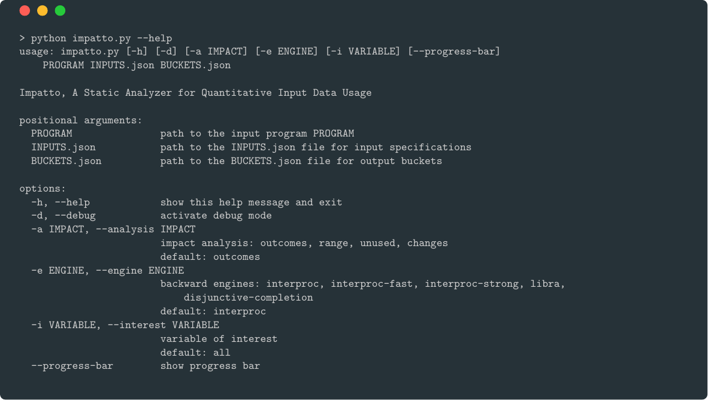
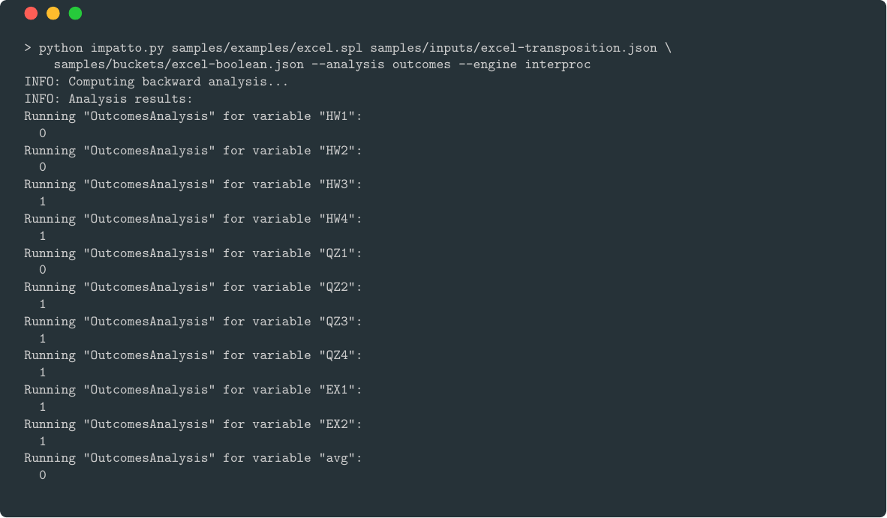

# Impatto

Impatto is a sound fully-automatic and always-terminating static analysis tool based on the quantitative framework for input data usage properties proposed by [Mazzucato, 2023](https://hal.science/hal-04339001).
Impatto leverages an underlying backward analyzer to compute the set of input-output relations of the program under analysis.
This backward analyzer is a parameter of the tool, allowing different kind of analyses such as program or neural network analysis.
Furthermore, the choice of the impact definition is also a parameter of the tool to better suit several factors, such as the program structure, the environment, and the intuition of the researcher.

> Please refer to the [tool-paper](https://denismazzucato.github.io/impatto.pdf) describing in detail Impatto for more information.

## TL;DR

### Installation

Impatto relies on [Conda](https://docs.conda.io/projects/conda/en/latest/user-guide/install/index.html) to manage its dependencies. The tool's backend outsources the backward engine to external tools. Currently, Impatto supports [interproc](https://github.com/jogiet/interproc), [libra](https://github.com/caterinaurban/libra), and a few custom ones.
See the helper menu for more information `python impatto.py --help`.


To install Impatto, run the following commands:
```bash
git clone https://github.com/denismazzucato/impatto
cd impatto
conda env create -f environment.yml -n impatto_env
```

To install external tools, please refer to their respective documentation. For example, `interproc` requires `opam`, `ocaml` (we recommend `opam ≥ 2.x` and `4.x ≤ ocaml`) and some c/OCaml libraries (`camllib`, `fixpoint`, and `apron`). To install dependencies and build `interproc`, run the following commands:
```bash
opam pin add -n git+https://github.com/jogiet/camllib.git#master
opam pin add -n git+https://github.com/jogiet/fixpoint.git#master
opam pin add -n git+https://github.com/jogiet/interproc.git#master
opam update
opam depext --yes interproc
opam install apron dune ocamlbuild ocamlfind -y
opam install --deps-only interproc
opam install interproc
```
To check that the installation succeeded, run `interproc --help`.

Then you can setup the backward engine `InterprocEngine` by modifying the configuration `engines/interproc.json` file. For example, as it follows:
```json
{
  "path": "interproc",
  "args": [
    "-analysis", "fbfb",
    "-domain", "polkastrict",
    "-widening", "5", "5",
    "-display", "text"
  ],
  "unroll": "5"
}
```

### Demo Screencast


https://youtu.be/-LtM0K_jP_M

Here, it follows the screenshots of the demo. First, we show the helper menu in which we can see the available analyses and backward engines.



The demo runs the *outcomes* analysis using the *interproc* engine on a program extracted from the [CheckCell](https://doi.org/10.1145/2660193.2660207) benchmark suite:
```python
def final_grade (
    HW1, HW2, HW3, HW4 ,
    QZ1, QZ2, QZ3, QZ4 ,
    EX1, EX2 ) :
  HW_coeff = 0.2
  QZ_coeff = 0.3
  EX_coeff = 0.5
  HW_avg = HW_coeff * ( HW1 + HW2 + HW3 + HW4 ) / 4
  QZ_avg = QZ_coeff * ( QZ1 + QZ2 + QZ3 + QZ4 ) / 4
  EX_avg = EX_coeff * ( EX1 + EX2 ) / 2
  avg = HW_avg + QZ_avg + EX_avg
  return avg
```

As `interproc` supports the `spl` language, we need to convert the program to `spl` first (program `examples/excel.spl`):
```spl
var HW1 : int, HW2 : int, HW3 : int, HW4 : int, QZ1 : int, QZ2 : int, QZ3 : int, QZ4 : int, EX1 : int, EX2 : int, result : int;
begin
  // INPUTBOUNDS
  result = 0.05 * HW1 + 0.05 * HW2 + 0.05 * HW3 + 0.05 * HW4 + 0.075 * QZ1 + 0.075 * QZ2 + 0.075 * QZ3 + 0.075 * QZ4 + 0.25 * EX1 + 0.25 * EX2;
  // BUCKET
end
```

As you can note, we also squashed the computations together to not deal with multiple temporary variables, and we added the `INPUTBOUNDS` and `BUCKET` annotations to be replaced in the setup phase of the engine.

Then, we run the analysis specifying that the variable of interest is `EX1`:
```bash
> python impatto.py examples/excel.spl inputs/excel-transposition.json buckets/excel-boolean.json \
    --analysis outcomes --engine interproc --interest EX1
```


Then, we run the same analysis over all the input variables:
```bash
> python impatto.py examples/excel.spl inputs/excel-transposition.json buckets/excel-boolean.json \
    --analysis outcomes --engine interproc
```



Additionally, let us turn on the debugging mode to see the analysis details:
```bash
> python impatto.py examples/excel.spl inputs/excel-transposition.json buckets/excel-boolean.json \
    --analysis outcomes --engine interproc --debug
```


Moreover, we can run neural network analyses. For example, let us consider the neural network `networks/python/diabetes__0_1_2_3_4__4_4.py`. The chosen backward engine is `complete-libra`, a custom version of [libra](https://github.com/caterinaurban/libra); and the *changes* analysis:
```bash
> python impatto.py networks/python/diabetes__0_1_2_3_4__4_4.py inputs/networks.json buckets/network2.json \
    --engine complete-libra --analysis changes --debug
```


<!-- ## TODO
[ ] Decouple the abstract domain from the engine and analysis, define common interfaces. Maybe the analyzer should be coupled with the returning abstract domain since it is called externally?
[ ] Fix variable name bug (variable can be more than one character via variable mapping)
[ ] Input variable selections
[ ] Progress for intersections in the bucket analysis (when debug is active) -->